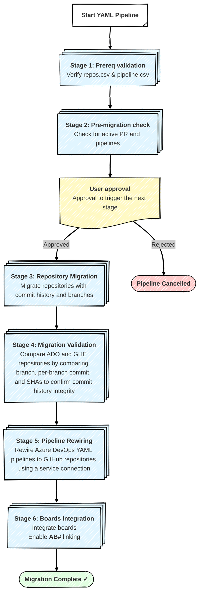

# 🚀 Azure DevOps to GitHub Repository Migration Pipeline

[](https://opensource.org/licenses/MIT)
[](https://azure.microsoft.com/en-us/services/devops/)
[](https://github.com/github/gh-ado2gh)

> A stage-based Azure DevOps pipeline for migrating repositories from Azure DevOps to GitHub Enterprise at scale. Supports batch migrations, automated validation, pipeline rewiring, and Azure Boards integration.

---

## 🎯 Migration Challenges at Enterprise Scale

Enterprise-scale repository migration from Azure DevOps to GitHub Enterprise is a multi-stage process that includes readiness validation, repository migration, post-migration verification, pipeline rewiring, and Azure Boards integration. When applied to thousands of repositories, this process becomes difficult to coordinate, error-prone, and hard to scale using ad-hoc scripts or centralized execution models.

This pipeline addresses those challenges through a staged, self-service migration model. Instead of relying on a single central team, individual product teams can migrate their own repositories using a standardized Azure DevOps YAML pipeline that orchestrates the entire lifecycle. This approach reduces operational bottlenecks, limits blast radius, and enforces consistency across all migrations.

At enterprise scale, this pipeline overcomes the following challenges:

- ⏱️ Serial execution does not scale for thousands of repositories
- 🚦 Centralized migration teams become bottlenecks
- ⚠️ All-at-once migrations increase risk and blast radius
- 🔍 Manual validation leads to errors and inconsistencies
- 📊 Tracking partial success and failures is operationally complex


## 📋 Table of Contents

- [Pipeline Execution Model](#-pipeline-execution-model)
- [Limitations](#️-limitations)
- [Prerequisites](#️-prerequisites)
- [Quick Start](#-quick-start-your-first-migration)
- [FAQ](#-frequently-asked-questions)
- [Contributing](#-contributing)
- [License](#-license)

---

## 📋 Pipeline Execution Model

> ℹ️ **Informational Only**  
> This section is provided for **conceptual understanding** of the pipeline flow.
> Actual execution behavior is governed by the YAML implementation.

This pipeline orchestrates a **six-stage sequential migration process** from Azure DevOps to GitHub Enterprise. Each stage runs on a **Microsoft-hosted Ubuntu agent** (`ubuntu-latest`) by default. Enable the "Use Self-Hosted Agent" parameter to run on your own agent pool.

### Key Features

- **Partial Success:**  **Stage 3 (Repository Migration)** publishes a `repos_with_status.csv` artifact that tracks which repositories migrated successfully and which failed. Stages 4-6 consume this artifact and execute **only against successfully migrated repositories**. **Stage 5 (Pipeline Rewiring)** has additional logic: it reads pipeline definitions from `pipelines.csv`, then cross-references with `repos_with_status.csv` to ensure rewiring only occurs for repositories that migrated successfully.

- **Manual Approval Gate:**  After **Stage 2 (Pre-migration Check)**, The pipeline pauses at a manual approval gate to allow review of active pull requests and running pipelines before migration. The approval expires after 3 days and is automatically rejected if not approved.

- **Stage Dependencies:**  Stages 1-3 require strict success. Stages 4-6 tolerate partial failures and will execute even if the previous stage completes with issues.

> **Note:** Since Ubuntu runners do not persist state between stages, the pipeline uses artifacts for cross-stage continuity.



### Stage Execution Details

Each stage executes a specific script and generates detailed logs. Stages 4-6 automatically process only repositories that migrated successfully in Stage 3.

### Stage 1️⃣: Prerequisite Validation
Performs validation checks to:

- Verify `bash/repos.csv` and `bash/pipelines.csv` exist.

### Stage 2️⃣: Pre-Migration Check
Executes `1_pr_pipeline_check.sh` to:

- Detects active builds, release pipelines, and pull requests

> **⚠️ IMPORTANT**: The pipeline pauses here for manual approval. Review the readiness report to ensure no active PRs or running pipelines exist before proceeding to Stage 3. Timeout: 3 days (auto-rejects if not approved).

### Stage 3️⃣: Repository Migration
Executes `2_migration.sh` to:

- Migrate repository content, branches, and commit history
- Create `repos_with_status.csv` tracking `success/failure` for each repository
- Publish artifact for downstream stages

### Stage 4️⃣: Repository Migration Validation
Executes `3_post_migration_validation.sh` (operates on successfully migrated repos only) to:

- Compare branch counts between ADO and GitHub repositories
- Verify commit counts match for each branch
- Validate latest commit SHAs to ensure complete migration

### Stage 5️⃣: Pipeline Rewiring
Executes `4_rewire_pipeline.sh` (operates on successfully migrated repos only) to:

- Rewire Azure DevOps pipelines to point to GitHub repositories via service connection

### Stage 6️⃣: Azure Boards Integration
Executes `5_boards_integration.sh` (operates on successfully migrated repos only) to:

- Integrate Azure Boards with migrated GitHub repositories
- Enable AB# work item linking in commits and pull requests

---

## ⚠️ Limitations

#### 1️⃣ What Gets Migrated 
- Git repository content (all files)
- Complete commit history
- All branches and tags
- Commit metadata (authors, dates, messages, SHAs)

**Recommendation:** Complete or abandon all active pull requests before migrating.

#### 2️⃣ Azure DevOps agent Timeout
- It is recommended to run the YAML pipeline on self-hosted agents, where the job timeout can be set to 0, allowing long-running migrations to complete without interruption. In contrast, Azure DevOps hosted agents are limited to a maximum runtime of 60 minutes.
- Additionally, the actual repository migration is executed on GitHub’s backend services, not on the Azure DevOps agent itself. The agent only runs lightweight scripts that poll the migration status at regular intervals (every 30–60 seconds).

- **Track Long-Running Migrations:**
If your pipeline times out, monitor migration progress using the GitHub CLI:

```bash
gh extension install mona-actions/gh-migration-monitor
gh migration monitor
```

[GitHub Migration Monitor](https://github.com/mona-actions/gh-migration-monitor)

#### 3️⃣ Pipeline Rewiring
- Only YAML-based pipelines are supported
- Classic pipelines (UI-defined) are NOT supported must be rewired manually. 

#### 4️⃣ Repository Migration Size Limits
The [GitHub Enterprise Importer](https://github.com/github/gh-ado2gh) has the following size limits:

| Item | Maximum Size |
|------|--------------|
| Repository archive | ~40 GiB |
| Single file (during migration) | 400 MiB |
| Single file (after migration) | 100 MiB (larger files must use Git LFS) |
| Single commit | 2 GiB |


---

## ⚙️ Prerequisites


> **Watch these video guides** before starting your first migration:

#### Part 1: Prerequisites Overview

https://github.com/user-attachments/assets/cdf6cc4e-ae3b-44ce-a1e6-937b1eeb4ca3

_Covers: CSV configuration, PAT tokens, service connections, and variable groups_

#### Part 2: Pipeline info

https://github.com/user-attachments/assets/ff93c5de-ba12-45e4-834d-31d3c7d8ef5b

_Covers: the pipeline design and how it works_

---

### Initial Setup

Complete these steps before your first migration pipeline run:

#### 1️⃣ 🧩 GitHub Service Connection

Ensure a GitHub service connection exists in Azure DevOps; create one if required:

1. Navigate to **Project Settings** → **Service connections**
2. Create new **GitHub** connection (choose "GitHub App" for best security)
3. Grant **Contributor** permissions on target GitHub org/repos
4. Copy the service connection ID (GUID)
5. Add ID to `serviceConnection` column in `bash/pipelines.csv`

**Example:**
```csv
serviceConnection: 3dfa8dac-601c-4b68-a4eb-29737c5ebf04
```

[Learn more about service connections](https://learn.microsoft.com/en-us/azure/devops/pipelines/library/service-endpoints)

---

#### 2️⃣ 🗂️ CSV Configuration Files

Edit two CSV template files in the `bash/` directory to define your migration scope:

**`bash/repos.csv`** - Repositories to migrate

| Column | Description |
|--------|-------------|
| `org` | Azure DevOps organization name |
| `teamproject` | Azure DevOps project name |
| `repo` | Azure DevOps repository name |
| `github_org` | Target GitHub organization |
| `github_repo` | Target GitHub repository name |
| `gh_repo_visibility` | `private`, `public`, or `internal` |

**`bash/pipelines.csv`** - Pipelines to rewire (Stage 5)

| Column | Description |
|--------|-------------|
| `org` | Azure DevOps organization name |
| `teamproject` | Azure DevOps project name |
| `repo` | Azure DevOps repository name (cross-references with repos.csv) |
| `pipeline` | Pipeline name/path (e.g., `\my-pipeline-ci`) |
| `url` | Pipeline URL (for reference) |
| `serviceConnection` | GitHub service connection ID (see Prerequisite #1) |
| `github_org` | Target GitHub organization |
| `github_repo` | Target GitHub repository name |


---

#### 3️⃣ 🔐 Authentication Tokens

Create **3 PAT tokens** with the following scopes:

**GitHub PAT #1 - Migration (Stages 1-5):**
- ✅ `repo` (Full control of private repositories)
- ✅ `workflow` (Update GitHub Action workflows)
- ✅ `admin:org` (Full control of orgs and teams)
- ✅ `read:user` (Read user profile data)

**GitHub PAT #2 - Boards Integration (Stage 6 only):**
- ✅ `repo` (Full control of private repositories)
- ✅ `admin:repo_hook` (Full control of repository hooks)
- ✅ `read:user` (Read user profile data)
- ✅ `user:email` (Access user email addresses)

**Azure DevOps PAT:**
- **Recommended**: `Full access` / Admin scope (simplest option)
- **Alternative**: Use minimum required scopes (see below)

<details>
<summary>📋 Minimum Required ADO PAT Scopes (click to expand)</summary>

- ✅ `Analytics` (Read)
- ✅ `Build` (Read)
- ✅ `Code` (Read, Full, Status)
- ✅ `GitHub Connections` (Read & manage)
- ✅ `Graph` (Read)
- ✅ `Identity` (Read)
- ✅ `Pipeline Resources` (Use)
- ✅ `User Profile` (Read)
- ✅ `Project and Team` (Read)
- ✅ `Release` (Read)
- ✅ `Security` (Manage)
- ✅ `Service Connections` (Read & query)
- ✅ `Work Items` (Read)

</details>

---

#### 4️⃣ 🔐 Variable Groups

Store your PAT tokens (from Prerequisite #3) in two Azure DevOps Variable Groups:

**Variable Group #1:** `core-entauto-github-migration-secrets` (Stages 1-6)

| Variable | Value | Used In |
|----------|-------|---------|
| `GH_PAT` | GitHub PAT #1 (migration scopes) | Stages 1-5 |
| `ADO_PAT` | Azure DevOps PAT | All stages |

**Variable Group #2:** `azure-boards-integration-secrets` (Stage 6 additional)

| Variable | Value | Used In |
|----------|-------|---------|
| `GH_PAT` | GitHub PAT #2 (boards scopes) | Stage 6 only |
| `ADO_PAT` | Azure DevOps PAT (same as Group #1) | Stage 6 |

> **Note:** Verify both variable groups are created and granted pipeline permissions. Modify the YAML file if variable group names differ.

---

#### 5️⃣ 🧪 Repo Migration-Only mode

Enable the `Repo migration & validation only` parameter in the Azure DevOps pipeline run dialog if you want to skip post-migration steps such as pipeline rewiring and Azure Boards integration.

**Behavior:**
- ✅ Runs Stages 1-4 (Prerequisites, Pre-migration Check, Repo Migration, Post Migration Validation)
- ❌ Skips Stages 5-6 (Pipeline Rewiring and Boards Integration)

**Rollback (if needed):**
```bash
# Navigate to GitHub repository settings
# https://github.com/<org>/<repo>/settings
# Scroll to "Danger Zone" → "Delete this repository"
```

---

## 🚀 Quick Start: Your First Migration

**Before you begin**, ensure you've completed the [Prerequisites](#️-prerequisites):
- ✅ Created 3 PAT tokens (1 ADO, 2 GitHub)
- ✅ Configured 2 Variable Groups in Azure DevOps
- ✅ Set up GitHub service connection
- ✅ Prepared CSV files in `bash/` directory

---

### Step-by-Step Instructions

#### 1️⃣ **Clone this pipeline repository**
   ```bash
   # Clone the ado2gh-ado-pipelines repository
   git clone <your-repo-url>
   cd ado2gh-ado-pipelines
   ```

#### 2️⃣ **Prepare CSV configuration files**
   ```bash
   # Edit repos.csv - Add repositories for your first run
   code bash/repos.csv
   
   # Edit pipelines.csv - Optional for Demo Mode, required for production
   code bash/pipelines.csv
   ```

   **Example repos.csv:**
   ```csv
   org,teamproject,repo,github_org,github_repo,gh_repo_visibility
   mycompany,Platform,api-service,mycompany-gh,platform-api,private
   mycompany,Platform,web-frontend,mycompany-gh,platform-web,private
   ```
   **Example pipelines.csv:**
   ```csv
   org,teamproject,repo,pipeline,url,serviceConnection,github_org,github_repo
   mycompany,Platform,api-service,\api-service-ci,https://dev.azure.com/mycompany/Platform/_build?definitionId=123,abc123-def4-56gh-78ij-90klmn1234op,mycompany-gh,platform-api
   mycompany,Platform,web-frontend,\web-frontend-ci,https://dev.azure.com/mycompany/Platform/_build?definitionId=456,abc123-def4-56gh-78ij-90klmn1234op,mycompany-gh,platform-web
   ```

#### 3️⃣ **Commit and push changes**
   ```bash
   git add bash/repos.csv bash/pipelines.csv
   git commit -m "Configure migration batch: test repositories"
   git push
   ```

#### 4️⃣ **Set up the pipeline in Azure DevOps** (first-time only)
   
   **If pipeline doesn't exist:**
   - Navigate to `https://dev.azure.com/<org>/<project>` → **Pipelines** → **New Pipeline**
   - Select your repository source (Azure Repos/GitHub)
   - Choose **Existing Azure Pipelines YAML file** → Select `ado2gh-migration.yml`
   - Click **Save** or **Run**
   
   **If pipeline already exists:**
   - Go to **Pipelines** → Select the migration pipeline → Click **Run pipeline**

#### 5️⃣ **Configure pipeline parameters**
   
   In the "Run pipeline" dialog, configure:
   
   **For Repo Migration-Only mode:**
   - Check the box: "Repo migration & validation only"

  **For Self-hosted agents:**
   - migration pipeline runs on self-Hosted agent pool.
   - Check the box: "Use Self-Hosted Agent"
   - provide the agent pool name: "Self-Hosted Agent Pool Name"
   
   Click **Run** to start the pipeline.

#### 6️⃣ **Monitor pipeline execution**
   
   | Stage | Key Actions | Expected Outcome |
   |-------|-------------|------------------|
   | **Stage 1: Prerequisite Validation** | View logs to verify CSV validation | ✅ "X repositories found" message |
   | **Stage 2: Pre-migration Check** | Download `readiness-logs` artifact | ✅ No active PRs or running pipelines |
   | **🔒 Manual Approval Gate** | Review readiness report, then **APPROVE** or **REJECT** | ✅ Approval granted (timeout: 3 days) |
   | **Stage 3: Repository Migration** | Monitor logs, check `repos_with_status.csv` artifact | ✅ Migration completes (success/partial) |
   | **Stage 4: Migration Validation** | Download `validation-logs`, check ✅/❌ indicators | ✅ Branch counts, commits, SHAs match |
   | **Stage 5: Pipeline Rewiring** | Download `rewiring-logs`, verify GitHub connection | ✅ Pipelines point to GitHub repos |
   | **Stage 6: Boards Integration** | Download `boards-integration-logs`, test AB#123 | ✅ Work item linking active |

#### 7️⃣ **Verify migration success**
   
   **Automated validation (Stage 4):**
   - Branch counts match between ADO and GitHub
   - Commit counts match for all branches
   - Latest commit SHAs match
   
   **Manual verification:**
   ```bash
   # Clone the migrated repository
   git clone https://github.com/<github_org>/<github_repo>.git
   cd <github_repo>
   
   # Verify branches exist
   git branch -a
   
   # Check commit history
   git log --oneline
   
   ```
   
  **Post-migration cleanup:**
   
   After successful migration, disable ADO repositories to prevent accidental commits:

  1. Edit `misc/disable_repo.csv` with the repos to disable (org,teamproject,repo)
  2. Run the disable script
   `export ADO_PAT="your-ado-pat-token"`
   `./misc/6_disable_repo.sh`
   
   > **Note:** The script automatically looks for `disable_repo.csv` in its own folder. Use `--csv <path>` to specify a different file.

---

### 🎉 Migration Complete!

**Next Steps:**
- **More migrations?** Update `bash/repos.csv` and rerun the pipeline
- **Troubleshooting?** See [FAQ](#-frequently-asked-questions)
- **Advanced configuration?** Review [Prerequisites](#️-prerequisites)

  
---

## ❓ Frequently Asked Questions

### Q1: Can multiple teams run this pipeline simultaneously?

**A:** Yes, **if migrating different repositories**.

**Best Practices:**
- Coordinate migration schedules across teams
- Use separate CSV files per team with **zero repository overlap**
- Ensure each repository appears in only one team's CSV file
- If uncertain, run migrations sequentially to avoid conflicts


### Q2: What happens to the ADO repository after migration?

**A:** The ADO repository remains **intact and unchanged**. Migration is a **copy operation**, not a move.
> **💡 Tip**: After confirming migration success, manually disable the ADO repository to prevent accidental commits.


### Q3: Can I migrate repositories from multiple ADO organizations?

**A:** Yes, but you need **separate ADO PAT tokens** for each organization.

**Requirements:**
- ✅ Create a **separate ADO PAT token for each organization**
- ✅ The pipeline currently supports **one ADO organization per run**
- ✅ To migrate from multiple orgs, run the pipeline **separately for each organization**


### Q4: How long does a typical migration take?

**A:** Highly variable based on repository size and batch size.

### Q5: Can I skip Stage 5 (Pipeline Rewiring) if I don't have pipelines?

**A:** No, you cannot skip stages. However, you can provide an **empty `pipelines.csv`** file with just the header row.

**Empty pipelines.csv:**

```csv
org,teamproject,repo,pipeline,url,serviceConnection,github_org,github_repo
```

### Q6: Does this pipeline migrate pull requests?

**A:** No, **pull requests are NOT migrated**.

### Q7: Can I migrate private ADO repos to public GitHub repos?

**A:** Yes, use `gh_repo_visibility: public` in repos.csv.


### Q8: What happens if migration fails halfway through?

**A:** The pipeline **continues processing successfully migrated repositories**. Stages 4-6 run only for repos that migrated successfully.

**How Partial Failures Work:**
- ✅ Stage 3 completes with **"Succeeded with issues"** status
- ✅ `repos_with_status.csv` tracks which repos succeeded/failed
- ✅ Stages 4-6 automatically skip failed repos and process only successful ones
- ✅ Pipeline completes all stages for successful repositories

### Q9: How do I validate that migration was successful?

**A:** Use the automated validation in **Stage 4**, plus manual verification

---

## 🤝 Contributing

Contributions are welcome! If you'd like to improve this pipeline or documentation:

1. **Fork the repository**
2. **Create a feature branch**: `git checkout -b feature/your-improvement`
3. **Make your changes** and commit: `git commit -m "Add: your improvement description"`
4. **Push to your fork**: `git push origin feature/your-improvement`
5. **Open a Pull Request** with a clear description of your changes

### Reporting Issues

If you encounter bugs or have feature requests:
- Check [existing issues](../../issues) first
- Create a new issue with:
  - Clear description of the problem/request
  - Steps to reproduce (for bugs)
  - Expected vs actual behavior
  - Pipeline logs (if applicable)

Please submit a PR or open an issue.

---

## 📄 License

MIT License

Copyright (c) 2025 Vamsi Cherukuri (<vamsicherukuri@hotmail.com>)

Permission is hereby granted, free of charge, to any person obtaining a copy
of this software and associated documentation files (the "Software"), to deal
in the Software without restriction, including without limitation the rights
to use, copy, modify, merge, publish, distribute, sublicense, and/or sell
copies of the Software, and to permit persons to whom the Software is
furnished to do so, subject to the following conditions:

The above copyright notice and this permission notice shall be included in all
copies or substantial portions of the Software.

THE SOFTWARE IS PROVIDED "AS IS", WITHOUT WARRANTY OF ANY KIND, EXPRESS OR
IMPLIED, INCLUDING BUT NOT LIMITED TO THE WARRANTIES OF MERCHANTABILITY,
FITNESS FOR A PARTICULAR PURPOSE AND NONINFRINGEMENT. IN NO EVENT SHALL THE
AUTHORS OR COPYRIGHT HOLDERS BE LIABLE FOR ANY CLAIM, DAMAGES OR OTHER
LIABILITY, WHETHER IN AN ACTION OF CONTRACT, TORT OR OTHERWISE, ARISING FROM,
OUT OF OR IN CONNECTION WITH THE SOFTWARE OR THE USE OR OTHER DEALINGS IN THE
SOFTWARE.

---

**Made with ❤️ for the DevOps community**
